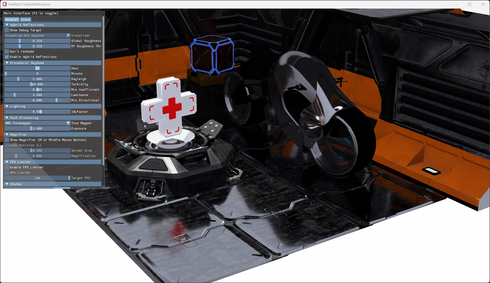

<!-- @page page_samples_hybrid-reflections FidelityFX Hybrid Reflections -->

<h1>FidelityFX Hybrid Reflections</h1>



This sample demonstrates the use of the FidelityFX Classifier and FidelityFX Denoiser techniques.

For details on the techniques that underpin the FidelityFX Hybrid Reflections effect you can refer to the respective [FidelityFX Classifier documentation](../techniques/classifier.md) and [FidelityFX Denoiser documentation](../techniques/denoiser.md).

<h2>Requirements</h2>

 - Windows
 - DirectX(R)12
 - Vulkan(R)
                                                                                     
<h2>UI elements</h2>

The sample contains various UI elements to help you explore the techniques it demonstrates. The table below summarises the UI elements and what they control within the sample.

| Element name | Value | Description |
| -------------|-------|-------------|
| **Show Debug Target** | `Checked/Unchecked` | Enable/Disable debug target. |
| **Visualizer** | `Visualize Hit Counter, Show Reflection Target, Visualize Primary Rays` | Choose the target to visualize |
| **Global Roughness Threshold** | `0.0 - 1.0` | Modifies the roughness cutoff for ray tracing. |
| **RT Roughness Threshold** | `0.0 - 1.0` | Modifies the roughness cutoff for ray tracing. |
| **Don't reshade** | `Checked/Unchecked` |  Use radiance from screen space shaded image (possible artifacts). |
| **Enable Hybrid Reflections** | `Checked/Unchecked` | Enable/Disable screen space hybridization. |

<h2>Setting up FidelityFX Hybrid Reflections</h2>

The FidelityFX Hybrid Reflections sample uses [FidelityFX Classifier](../techniques/classifier.md) to generate a denoise tile list and a ray tracing tile list, [FidelityFX Single Pass Downsampler](../techniques/single-pass-downsampler.md) to create a depth hierarchy for depth buffer travesal, and [FidelityFX Denoiser](../techniques/denoiser.md) to remove noise from the results of tracing jittered reflection rays

<h3>Setting up FidelityFX Classifier</h3>

Include the interface for the backend of the FidelityFX Classifier API.

C++:

```C++
#include <FidelityFX/host/ffx_classifier.h>
```
Create FidelityFX Classifier context

```C++
    m_ClassifierInitializationParameters.flags = FfxClassifierInitializationFlagBits::FFX_CLASSIFIER_REFLECTION;
    m_ClassifierInitializationParameters.flags |= GetConfig()->InvertedDepth ? FFX_CLASSIFIER_ENABLE_DEPTH_INVERTED : 0;
    m_ClassifierInitializationParameters.resolution.width  = resInfo.RenderWidth;
    m_ClassifierInitializationParameters.resolution.height = resInfo.RenderHeight;
    m_ClassifierInitializationParameters.backendInterface  = m_BackendInterface;
    FFX_ASSERT(ffxClassifierContextCreate(&m_ClassifierContext, &m_ClassifierInitializationParameters) == FFX_OK);
```
Set up the dispatch parameters and dispatch

```C++
    FfxClassifierReflectionDispatchDescription dispatchParameters = {};
    dispatchParameters.commandList               = ffxGetCommandList(pCmdList);
    ...
    FfxErrorCode errorCode = ffxClassifierContextReflectionDispatch(&m_ClassifierContext, &dispatchParameters);
```

<h3>Setting up depth downsampler</h3>

Include the interface for the backend of FidelityFX Single Pass Downsampler (SPD) API.

C++:

```C++
#include <FidelityFX/host/ffx_spd.h>
```
Create FidelityFX SPD context

```C++
    m_SpdInitializationParameters.flags = 0;
    m_SpdInitializationParameters.flags |= FFX_SPD_WAVE_INTEROP_WAVE_OPS;
    m_SpdInitializationParameters.downsampleFilter = GetConfig()->InvertedDepth ? FFX_SPD_DOWNSAMPLE_FILTER_MAX : FFX_SPD_DOWNSAMPLE_FILTER_MIN;
    m_SpdInitializationParameters.backendInterface = m_BackendInterface;
    FFX_ASSERT(ffxSpdContextCreate(&m_SpdContext, &m_SpdInitializationParameters) == FFX_OK);
```

Copy the depth buffer into the depth hierarchy, set up the dispatch parameters, and dispatch

```C++
    FfxSpdDispatchDescription dispatchParameters = {};
    dispatchParameters.commandList               = ffxGetCommandList(pCmdList);
    ...
    FfxErrorCode errorCode = ffxSpdContextDispatch(&m_SpdContext, &dispatchParameters);
```

<h3>Setting up the FidelityFX Denoiser</h3>

Include the interface for the backend of the FidelityFX Denoiser API.

C++:

```C++
#include <FidelityFX/host/ffx_denoiser.h>
```

Create the FidelityFX Denoiser context

```C++
    m_DenoiserInitializationParameters.flags                      = FfxDenoiserInitializationFlagBits::FFX_DENOISER_REFLECTIONS;
    m_DenoiserInitializationParameters.windowSize.width           = resInfo.RenderWidth;
    m_DenoiserInitializationParameters.windowSize.height          = resInfo.RenderHeight;
    m_DenoiserInitializationParameters.normalsHistoryBufferFormat = GetFfxSurfaceFormat(m_pNormal->GetFormat());
    m_DenoiserInitializationParameters.backendInterface           = m_BackendInterface;
    FFX_ASSERT(ffxDenoiserContextCreate(&m_DenoiserContext, &m_DenoiserInitializationParameters) == FFX_OK);
```

Set up the dispatch parameters and dispatch

```C++
    FfxDenoiserReflectionsDispatchDescription denoiserDispatchParameters = {};
    denoiserDispatchParameters.commandList = ffxGetCommandList(pCmdList);
    ...
    FfxErrorCode errorCode = ffxDenoiserContextDispatchReflections(&m_VRSContext, &dispatchParameters);
```

<h2>Sample controls and configurations</h2>

For sample controls, configuration, and FidelityFX Cauldron Framework UI element details, see [Running the samples](../getting-started/running-samples.md).


<h2>See also</h2>

- [FidelityFX Classifier](../techniques/classifier.md)
- [FidelityFX Single Pass Downsampler](../techniques/single-pass-downsampler.md)
- [FidelityFX Denoiser](../techniques/denoiser.md)
- [FidelityFX Stochastic Screen-Space Reflections](../techniques/stochastic-screen-space-reflections.md)
- [FidelityFX Naming guidelines](../getting-started/naming-guidelines.md)
